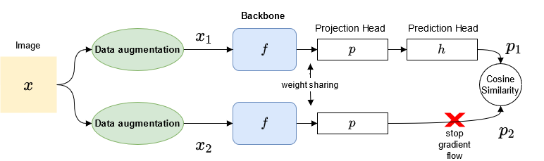
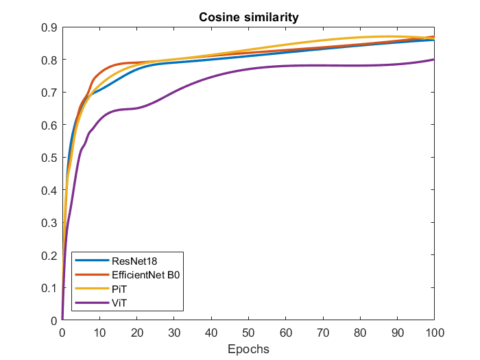

# Ablation study on self-supervised training of CNNs and Vision Transformers (ViT)

Tested self-supervised technique Exploring simple siamese representation learning ov various CNN and ViT architectures using the self-supervised method from 
[Exploring Simple Siamese Representation Learning](https://openaccess.thecvf.com/content/CVPR2021/papers/Chen_Exploring_Simple_Siamese_Representation_Learning_CVPR_2021_paper.pdf)





 

Git: https://github.com/facebookresearch/simsiam

## Requirements

## How to run

### Using config files
Modify the configurations in `.ynl` config files, then run:

  ```
  python train_simsiam.py --config config.yml
  ```
  
for self-supervised training with sim

### Resuming from checkpoints
You can resume from a previously saved checkpoint and run the supervised task  for classification by:

  ```
  python main.py --resume path/to/checkpoint
  ```

## Results

### Training diagram



### Tables from paper

| Image size    | Pretrain | Dataset  | Validation acc | Test acc       |
|---------------|----------|----------|----------------|----------------|
| 32 x 32 | CIFAR-10 | CIFAR-10 | 88.59          | 88.89          |
| 32 x 32 | Random   | CIFAR-10 | 83.87          | 83.12          |
| 32 x 32 | No       | CIFAR-10 | 75.68          | 75.23          |


| Model           | Pretrained weights | Test acc                  |
|-----------------|--------------------|---------------------------|
| ResNet-18       | No                 | 65.73             |
|                 | STL-10             | 70.23                     |
|                 | ImageNet           | 89.82                     |
| EfficientNet-B0 | No                 | 65.30             |
|                 | STL-10             | 69.84                     |
|                 | ImageNet           | 95.03                     |
| ViT             | No                  | 53.74            |
|                 | STL-10             | 60.45                     |
|                 | ImageNet           | 96.26                     |
| PiT             | No                 | 58.14             |
|                 | STL-10             | 64.21                     |
|                 | ImageNet           | 87.31                     |


| Model     | Pretrained weights |           |            |            |            |            |            |            |            |  
|-----------|--------------------|------------|-----------|-----------|-----------|-----------|-----------|-----------|-----------|
|           |                    | MacroAcc    |MacroAUC  | MicroAcc    |MicroAUC | MacroAcc | MacroAUC |Micro Acc | MicroAUC    |
| ResNet-18 | No Pretrain        | 0.5377       | 0.9339    | 0.6522  | 0.9552     | 0.5311 | 0.9301 | 0.6403 | 0.9517 |
| ResNet-18 | CelebA             | 0.5449 | 0.9340       | 0.6549     | 0.9608     | 0.5405 | 0.9310 | 0.6448 | 0.9592 |
| ResNet-18 | Imagenet           | 0.5898  | 0.9391     | 0.6690      | 0.9634     | 0.5826 | 0.9369 | 0.6622 | 0.9617 |
| PiT       | No Pretrain        | 0.5301   | 0.9297    | 0.6412     | 0.9504      | 0.5289 | 0.9265 | 0.6374 | 0.9494 |
| PiT       | CelebA             | 0.5413    | 0.9311      | 0.6579     | 0.9591      | 0.5389 | 0.9303 | 0.6416 | 0.9578 |
| PiT       | Imagenet           | 0.5910     | 0.9440      | 0.6804      | 0.9671     | 0.5841 | 0.9487 | 0.6723 | 0.9623 |


## Contributing

Any kind of enhancement or contribution is welcomed.

## Acknowledgments
Please cite 


```
@inproceedings{chen2021exploring,
  title={Exploring simple siamese representation learning},
  author={Chen, Xinlei and He, Kaiming},
  booktitle={Proceedings of the IEEE/CVF Conference on Computer Vision and Pattern Recognition},
  pages={15750--15758},
  year={2021}
}


@article{papastratis2021ablation,
  title={Ablation study of self-supervised learning for image classification},
  author={Papastratis, Ilias},
  journal={arXiv preprint arXiv:2112.02297},
  year={2021}
}

```
